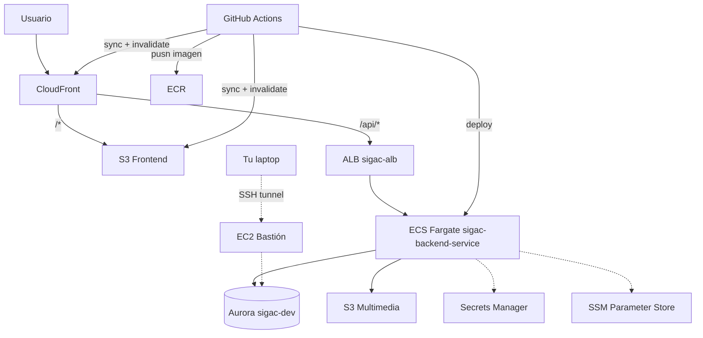

# Despliegue e Infraestructura — SIGAC

> Documento generado a partir de la reconstrucción del despliegue en AWS realizada el 2026-07-24, tras eliminar los recursos previos para controlar costos. Refleja el estado real de la infraestructura a esa fecha — si borras o modificas recursos después, actualiza este documento a mano.

## 1. Resumen

SIGAC corre en AWS con una arquitectura de **costo variable**: la base de datos escala a cero automáticamente cuando no se usa, y el backend puede apagarse manualmente entre periodos de prueba. El único componente con costo fijo mensual inevitable es el Application Load Balancer (ver sección 4).

## 2. Tecnologías usadas

| Capa | Tecnología |
|---|---|
| Backend | Java 21, Spring Boot 3.5.x, Spring Security (JWT), Spring Data JPA / Hibernate, Flyway (migraciones), HikariCP, Maven |
| Frontend | React 19, Vite, Axios |
| Base de datos | MySQL 8.0 (Aurora MySQL-Compatible Edition, motor `8.0.mysql_aurora.3.12.0`) |
| IA | Google Gemini (`gemini-2.0-flash`) para clasificación de incidencias, con fallback a reglas si no hay API key |
| Contenedores | Docker, build multi-stage (`eclipse-temurin:21-jdk-alpine` → `eclipse-temurin:21-jre-alpine`), usuario no-root |
| CI/CD | GitHub Actions (`.github/workflows/deploy.yml`) |

## 3. Arquitectura y flujo de tráfico

```
Usuario → CloudFront (dih930xv8x8fd.cloudfront.net)
            ├─ "/*"      → S3 (sigac-frontend-prod)       — frontend estático (React build)
            └─ "/api/*"  → ALB (sigac-alb, puerto 80)
                              → Target Group (sigac-backend-tg, puerto 8080)
                                → ECS Fargate task (sigac-backend-service, en sigac-cluster)
                                    → Aurora MySQL Serverless v2 (sigac-dev), puerto 3306
                                    → S3 (sigac-multimedia-prod) — fotos/evidencia de incidencias
                                    → Google Gemini API (clasificación IA)
```

Acceso administrativo a la base de datos (migraciones manuales, MySQL Workbench, etc.) se hace por **túnel SSH a través de un bastión EC2** — nunca exponiendo la base directamente a internet (ver sección 7).

## 4. Servicios AWS usados

| Servicio | Recurso | Propósito | Comportamiento de costo |
|---|---|---|---|
| Aurora (MySQL-Compatible) | Clúster `sigac-dev`, instancia `sigac-dev-instance-1` | Base de datos principal | **Serverless v2 con auto-pausa** (0–1 ACU). Escala a $0 de cómputo tras ~5 min sin conexiones. Solo se paga almacenamiento (~$0.10/GiB-mes) mientras está pausada |
| ECS (Fargate) | Clúster `sigac-cluster`, servicio `sigac-backend-service`, task def `sigac-backend` | Backend Spring Boot | Se cobra por segundo mientras `desiredCount > 0` (0.5 vCPU / 1 GB). Se puede escalar a 0 manualmente |
| ELB (ALB) | `sigac-alb` | Balanceador HTTP hacia el backend | **Costo fijo ~$16-20/mes**, corra o no tráfico — no tiene modo "apagado". Es el único componente sin opción de costo-cero real |
| ECR | Repositorio `sigac-backend` | Almacena las imágenes Docker del backend | Solo costo de almacenamiento de imágenes (mínimo) |
| S3 | `sigac-frontend-prod`, `sigac-multimedia-prod` | Frontend estático + multimedia de incidencias | Pago por almacenamiento/transferencia, insignificante a bajo tráfico |
| CloudFront | Distribución `E1T26QC6SBKCVD` (`dih930xv8x8fd.cloudfront.net`) | CDN del frontend + proxy hacia el ALB en `/api/*` | Pago por request/transferencia. Se puede **deshabilitar** por completo sin borrar la distribución |
| Secrets Manager | Secreto gestionado por RDS para el usuario maestro de Aurora | Credenciales de la BD, resueltas directo por ECS (nunca en texto plano en SSM ni en el código) | ~$0.40/mes por secreto + llamadas de acceso |
| SSM Parameter Store | `/sigac/DB_URL`, `/sigac/JWT_SECRET`, `/sigac/CORS_ALLOWED_ORIGINS`, `/sigac/BOOTSTRAP_SECRET`, `/sigac/GEMINI_API_KEY` (todos `SecureString`) | Configuración/secretos que lee la task definition | Gratis (parámetros estándar) |
| KMS | `aws/rds`, `aws/secretsmanager` (claves administradas por AWS) | Cifrado en reposo de Aurora y de los secretos | Costo mínimo por uso de claves administradas |
| VPC | VPC por defecto (`vpc-057016ca11eaa988c`), 6 subnets | Red de todos los recursos | Sin costo (no hay NAT Gateway) |
| Security Groups | `sigac-alb-sg`, `sigac-backend-task-sg`, `sigac-dev-aurora-sg`, `sigac-bastion-sg` | Control de acceso por puerto/origen | Sin costo |
| EC2 | Instancia `sigac-bastion` (t3.micro) | Bastión SSH para acceder a Aurora desde herramientas como MySQL Workbench | Se paga solo mientras está **corriendo**; detenida solo cobra el EBS (centavos/mes) |
| CloudWatch Logs | Grupo `/ecs/sigac-backend` | Logs de la aplicación | Pago por ingesta/almacenamiento, mínimo a este volumen |
| IAM | Roles `ecsTaskExecutionRole`, `sigacTaskRole`; usuario `CLIAcceso` | Permisos de ejecución de tareas ECS y de administración vía CLI | Sin costo |

## 5. Cómo optimizar costos mientras no se usa (sin borrar nada)

Esto es lo que se dejó configurado por defecto — no requiere acción para ahorrar en la base de datos, pero el backend y el bastión sí hay que apagarlos a mano:

| Recurso | Se apaga solo? | Acción manual si aplica |
|---|---|---|
| Aurora (`sigac-dev`) | **Sí**, automáticamente (auto-pausa a los ~5 min de inactividad) | Ninguna — solo espera |
| Bastión EC2 | No | `aws ec2 stop-instances --instance-ids i-0fa3ba425bc3f695c --region us-east-1` |
| Backend ECS | No | `aws ecs update-service --cluster sigac-cluster --service sigac-backend-service --desired-count 0 --region us-east-1` (vuelve a `--desired-count 1` para reactivar) |
| ALB | No tiene modo apagado | Ver sección 6 si se quiere eliminar temporalmente |
| CloudFront | No | `aws cloudfront get-distribution-config --id E1T26QC6SBKCVD` → cambiar `Enabled` a `false` → `update-distribution` |

> Si escalas el backend a 0, `/api/*` empezará a devolver errores del ALB (no hay tarea que responda) — hazlo solo si también vas a pausar el frontend, o acepta ese estado como "en mantenimiento".

## 6. Cómo terminar/borrar todo por completo

Esto es lo que se hizo la vez anterior para frenar gastos. Orden recomendado (de "hoja" a "raíz", para evitar errores de dependencias):

```bash
# 1. Backend
aws ecs update-service --cluster sigac-cluster --service sigac-backend-service --desired-count 0 --region us-east-1
aws ecs delete-service --cluster sigac-cluster --service sigac-backend-service --force --region us-east-1
aws ecs delete-cluster --cluster sigac-cluster --region us-east-1

# 2. Balanceador
aws elbv2 describe-load-balancers --names sigac-alb --region us-east-1 --query 'LoadBalancers[0].LoadBalancerArn'
aws elbv2 delete-load-balancer --load-balancer-arn <ARN-DEL-PASO-ANTERIOR> --region us-east-1
aws elbv2 delete-target-group --target-group-arn arn:aws:elasticloadbalancing:us-east-1:954096903879:targetgroup/sigac-backend-tg/729fd72cecf7b3ff --region us-east-1

# 3. Bastión
aws ec2 terminate-instances --instance-ids i-0fa3ba425bc3f695c --region us-east-1

# 4. Base de datos (toma un snapshot final si quieres poder recuperarla)
aws rds delete-db-instance --db-instance-identifier sigac-dev-instance-1 --skip-final-snapshot --region us-east-1
aws rds delete-db-cluster --db-cluster-identifier sigac-dev --skip-final-snapshot --region us-east-1
# (quita --skip-final-snapshot y agrega --final-db-snapshot-identifier sigac-dev-final si prefieres conservar un respaldo)

# 5. Security groups (después de que ya no los use nada de lo anterior)
aws ec2 delete-security-group --group-id sg-0ca5db7e9250724df --region us-east-1  # sigac-alb-sg
aws ec2 delete-security-group --group-id sg-0a034a8032bb8930f --region us-east-1  # sigac-backend-task-sg
aws ec2 delete-security-group --group-id sg-09d039cb916c91444 --region us-east-1  # sigac-dev-aurora-sg
aws ec2 delete-security-group --group-id sg-0c5af9756560f3cce --region us-east-1  # sigac-bastion-sg
```

**No borres estos a menos que abandones el proyecto por completo** (no forman parte del ciclo "pausa/reactiva" normal, y recrearlos toma más trabajo):
- CloudFront (`E1T26QC6SBKCVD`) y los buckets S3 (`sigac-frontend-prod`, `sigac-multimedia-prod`) — mejor solo deshabilitar CloudFront
- El repositorio ECR (`sigac-backend`) — borrarlo obliga a rebuildear la imagen desde cero
- Los parámetros SSM (`/sigac/*`) y los roles IAM (`ecsTaskExecutionRole`, `sigacTaskRole`) — se reusan tal cual en cada reconstrucción

## 7. Acceso a la base de datos para migraciones/administración

La base de datos **no es públicamente accesible** (correcto y verificado). Para conectarte con MySQL Workbench u otra herramienta:

1. Arranca el bastión si está apagado: `aws ec2 start-instances --instance-ids i-0fa3ba425bc3f695c --region us-east-1` (la IP pública cambia cada vez que arranca — consúltala con `describe-instances`)
2. Túnel SSH: `ssh -i C:/Users/David/sigac-bastion-key.pem -L 3306:sigac-dev.cluster-c4pqggsmcpp4.us-east-1.rds.amazonaws.com:3306 ec2-user@<IP-DEL-BASTION>`
3. En Workbench, conecta a `127.0.0.1:3306` — el usuario/contraseña están en el secreto de Secrets Manager (`rds!cluster-ccb390fc-1fb6-4396-9e1c-7567230b3e62-y9RfhQ`), nunca los guardes en texto plano en un archivo del repo
4. Cuando termines, cierra el túnel y **apaga el bastión** (`stop-instances`) — no lo dejes corriendo

## 8. CI/CD

- Workflow: `.github/workflows/deploy.yml`, se dispara en cada push a `main` (o manualmente vía `workflow_dispatch`)
- Dos jobs independientes: `deploy-backend` (build JAR → imagen Docker → ECR → nueva revisión de task definition → `ecs update-service`) y `deploy-frontend` (`npm run build` → sync a S3 → invalidación de CloudFront)
- Los secrets de GitHub Actions (`ECS_CLUSTER`, `ECS_SERVICE`, `ECS_TASK_DEFINITION`, `ECS_CONTAINER_NAME`, `S3_BUCKET_FRONTEND`, `CLOUDFRONT_DISTRIBUTION_ID`, etc.) ya apuntan a los nombres de recursos actuales — no requieren cambios mientras se reconstruya con los mismos nombres
- **Regla del proyecto:** nunca commitear directo a `main` (dispara despliegue a producción automáticamente) — trabajar en `develop` o `feature/*` y mergear vía PR

## 9. Notas de seguridad relevantes

- Las credenciales de la BD nunca se guardan en archivos del repo ni en SSM en texto plano visible — se resuelven en tiempo de ejecución desde Secrets Manager (ECS) o mediante `aws secretsmanager get-secret-value` ejecutado directamente por un humano (nunca por un agente/IA, ver `run-local-aurora.sh` en la raíz del repo, que está en `.gitignore`)
- Ningún recurso tiene `0.0.0.0/0` abierto salvo el ALB en el puerto 80 (necesario, es el punto de entrada público detrás de CloudFront)
- La base de datos solo acepta conexiones desde el security group de las tareas ECS y el del bastión — nunca directo desde internet

## 10. Instrucciones para hacer el diagrama tú mismo

### Herramienta recomendada

- **draw.io / diagrams.net** (gratis, sin cuenta, trae una librería de iconos oficiales de AWS integrada: busca "AWS19" o "AWS 2024" en el panel de formas) — la opción más simple para un diagrama de despliegue como el que ya tienes planeado en "Planificación - SIGAC.md"
- Alternativa: Lucidchart si ya lo usas para los demás diagramas del proyecto (casos de uso, clases, etc.)

### Componentes a incluir (con su ícono de categoría en AWS19)

| Componente | Categoría de ícono AWS | Nombre a poner en la caja |
|---|---|---|
| CloudFront | Networking & Content Delivery | `CloudFront (dih930xv8x8fd)` |
| S3 (x2) | Storage | `S3 - Frontend` / `S3 - Multimedia` |
| Application Load Balancer | Networking & Content Delivery | `ALB - sigac-alb` |
| ECS (Fargate) | Containers | `ECS Fargate - sigac-backend-service` |
| Aurora MySQL | Database | `Aurora Serverless v2 - sigac-dev` |
| Secrets Manager | Security, Identity & Compliance | `Secrets Manager` |
| SSM Parameter Store | Management & Governance | `SSM Parameter Store` |
| ECR | Containers | `ECR - sigac-backend` |
| EC2 (bastión) | Compute | `EC2 Bastion (apagado por defecto)` |
| VPC (contenedor que agrupa ALB + ECS + Aurora + bastión) | Networking & Content Delivery | `VPC vpc-057016ca11eaa988c` |
| GitHub Actions | fuera de AWS, ícono genérico de CI/CD | `GitHub Actions (deploy.yml)` |

### Flechas / conexiones a dibujar

1. Usuario (ícono de persona) → CloudFront
2. CloudFront → S3 Frontend (etiqueta: `/*`)
3. CloudFront → ALB (etiqueta: `/api/*`)
4. ALB → ECS Fargate (etiqueta: `puerto 8080`)
5. ECS Fargate → Aurora (etiqueta: `puerto 3306, dentro de la VPC`)
6. ECS Fargate → S3 Multimedia
7. ECS Fargate → Secrets Manager y → SSM (líneas punteadas, "lee configuración al iniciar")
8. EC2 Bastión → Aurora (línea punteada, etiqueta: `solo cuando se activa manualmente`)
9. Tu laptop → EC2 Bastión (línea punteada, etiqueta: `túnel SSH`)
10. GitHub Actions → ECR y → ECS (etiqueta: `push de imagen + despliegue`), y → S3 Frontend + CloudFront (etiqueta: `sync + invalidación`)

### Sugerencia de agrupación visual

Dibuja un rectángulo grande de fondo etiquetado "AWS" que contenga todo, y dentro otro rectángulo etiquetado "VPC" que contenga solo ALB + ECS + Aurora + Bastión (S3, CloudFront, ECR, Secrets Manager y SSM quedan fuera de la VPC, son servicios gestionados). Eso deja visualmente claro qué está "en red privada" y qué es un servicio administrado sin VPC.

### Bonus: versión Mermaid lista para pegar en Obsidian

Como tus otras notas de este vault ya usan Obsidian, esto se renderiza solo si lo pegas en una nota (no reemplaza el diagrama de despliegue formal, pero sirve como referencia rápida):


